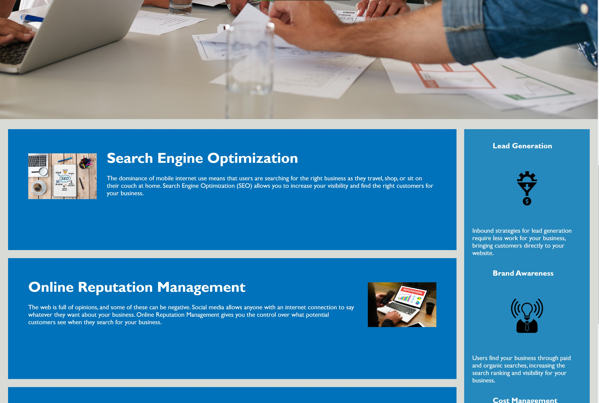
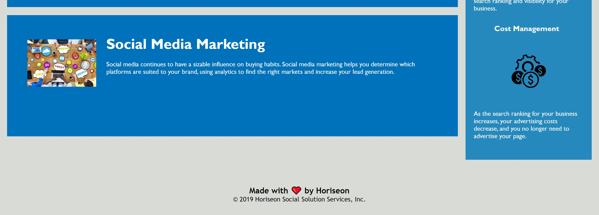

# Horiseon Digital Marketing

## The Project

A digital marketing company was in need of an upgrade to their website. The code was repetitive, did not flow correctly, and did not function as well as it could have. In order for a business to survive, they need to have a website that is as great as the product they are delivering.

## Issues

From the start, the HTML file was very wordy. Almost every child had its own class and that just made everything look very messy. A number of tags did not have closing tags and some closing tags did not belong to an opening tag. The CSS was also quite a mess. The file did not follow the flow of the HTML at all. Elements at the bottom of the webpage were getting formatted before some of the elements at the top. Because of all the classes made in the HTML, the CSS was much longer and wordier than it needed to be. For example, a different class was given to each card, eventhough they were formatted exactly the same. All of the images (in their respective parent) were formatted the same way, but were given different format instructions in the CSS. Finally, there was absolutely no commenting or meta data, and this is for a digital marketing company!

## The Website

## Fixing The Errors

To begin with, I made sure all of the indentation was correct and matched every opening tag to a closing tag. Once the formatting looked presentable,  I made sure to consolidate all of the unnecessary classes and make as few as possible while maintaining functionality. I was able to take the classes that were part of each card and make the entire set of cards fall under one class. The same goes for the images that were located inside the cards. Once the class situation was under control, I moved on to the interactive elements of the page. The navigation elements in the header did not quite work. The IDs for the cards that they were supposed to navigate to did not have the right paths. Once that was cleared up, I moved on to the CSS. Because I had removed so many classes, I needed to clean up the CSS almost entirely. The CSS went from 200 lines (without comments) to 167 with comments. Once the CSS was tidy, it was time to re-order the formatting to match the flow of the HTML. That task was not difficult as most of it was simple cut and paste. Once everything was mirrored to the HTML and all was working correctly, I added comments to make sure someone else knew what I was up to when they saw the code and push all of my work to Github.

## Lessons Learned

Before staring the project, I was unaware just how important mirroring the CSS to the HTML was for ease of understanding. When looking at the raw code prior to re-organizing, I had to sit and think what exactly the CSS line I was studying was actually formatting. I was also unaware of how important good class labeling is. Giving a random name to a class that you plan on using is not good practice and you should try to title everything to best match what it relates to. Prior to this project, I was not the biggest fan of commenting. After getting lost trying to find what image was being edited by a CSS line for the 3rd time, I realised just how important it can be, even for yourself. All in all, this project was a great learning experience and a valuable stepping stone into development.